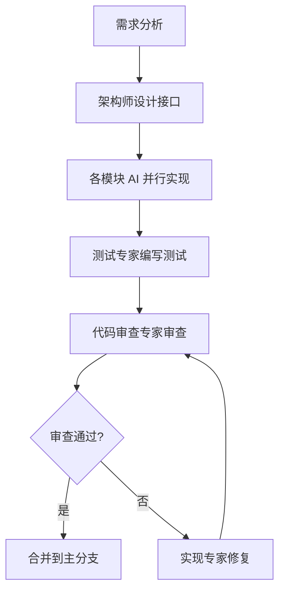

# QiaKon KAG 平台 - 根 AGENTS.md

> **项目**: QiaKon KAG (Knowledge Answer Graph) 平台  
> **版本**: v1.0  
> **日期**: 2026-04-28  
> **目标**: 建立多 AI 协同工作规范，确保各模块开发一致性

---

## 一、项目概述

QiaKon 是企业级 KAG 平台，将知识图谱的结构化推理能力与 RAG 的灵活检索能力深度融合，提供准确、可信、可溯源的智能问答能力。

**核心价值**:
- 知识可信：基于知识图谱，答案可溯源、可审计
- 推理可解释：显式推理链路，决策过程透明
- 检索精准：混合检索（向量+关键词+图谱关系）
- 领域适配：MoE 分块策略，适配不同领域
- 工程可扩展：模块化架构，连接器模式

---

## 二、模块架构与职责分工

### 2.1 模块总览

| 模块                           | 职责                               | AI Agent 类型 | 文档                                                  |
| ------------------------------ | ---------------------------------- | ------------- | ----------------------------------------------------- |
| `QiaKon.Api`                   | HTTP API 层，路由、中间件、认证    | 后端实现专家  | [AGENTS.md](src/QiaKon.Api/AGENTS.md)                 |
| `QiaKon.Contracts`             | 通用契约、实体基类、接口定义       | 架构师        | [AGENTS.md](src/QiaKon.Contracts/AGENTS.md)           |
| `QiaKon.Cache.*`               | 多级缓存（Memory/Hybrid/Redis）    | 后端实现专家  | [AGENTS.md](src/QiaKon.Cache.Hybrid/AGENTS.md)        |
| `QiaKon.Connector.*`           | 外部系统连接器（Http/Npgsql）      | 后端实现专家  | [AGENTS.md](src/QiaKon.Connector/AGENTS.md)           |
| `QiaKon.Llm.*`                 | LLM 核心、上下文、Prompt、Provider | AI 工程师     | [AGENTS.md](src/QiaKon.Llm/AGENTS.md)                 |
| `QiaKon.Workflow`              | 工作流引擎（Step/Stage/Pipeline）  | 后端实现专家  | [AGENTS.md](src/QiaKon.Workflow/AGENTS.md)            |
| `QiaKon.Retrieval.*`           | 检索管道（分块/嵌入/向量存储）     | AI 工程师     | [AGENTS.md](src/QiaKon.Retrieval/AGENTS.md)           |
| `QiaKon.Graph.Engine.*`        | 知识图谱引擎（Memory/Npgsql）      | 后端实现专家  | [AGENTS.md](src/QiaKon.Graph.Engine/AGENTS.md)        |
| `QiaKon.Queue.*`               | 消息队列（Kafka/Memory）           | 后端实现专家  | [AGENTS.md](src/QiaKon.Queue/AGENTS.md)               |
| `QiaKon.EntityFrameworkCore.*` | EF Core 集成                       | 数据库专家    | [AGENTS.md](src/QiaKon.EntityFrameworkCore/AGENTS.md) |
| `frontend`                     | 前端 Web 应用（React + Vite + TS） | 前端实现专家  | [AGENTS.md](frontend/AGENTS.md)                       |

### 2.2 依赖关系

```
QiaKon.Api
├── QiaKon.Llm.*
│   ├── QiaKon.Llm.Context
│   ├── QiaKon.Llm.Prompt
│   ├── QiaKon.Llm.Providers
│   └── QiaKon.Llm.Tokenization
├── QiaKon.Workflow
├── QiaKon.Retrieval.*
│   ├── QiaKon.Retrieval.Chunking
│   ├── QiaKon.Retrieval.Embedding
│   └── QiaKon.Retrieval.VectorStore.*
├── QiaKon.Graph.Engine.*
├── QiaKon.Connector.*
├── QiaKon.Cache.*
├── QiaKon.Queue.*
└── QiaKon.Contracts (所有模块依赖)
```

---

## 三、多 AI 协同工作规范

### 3.1 AI Agent 角色定义

| 角色             | 职责                                 | 触发条件                       |
| ---------------- | ------------------------------------ | ------------------------------ |
| **架构师**       | 技术方案设计、接口定义、模块边界划分 | 新模块创建、接口变更、架构重构 |
| **后端实现专家** | C#/.NET 具体实现、Bug 修复、性能优化 | 后端编码、调试、重构           |
| **AI 工程师**    | LLM 集成、Prompt 工程、Agent 编排    | LLM 相关模块开发               |
| **前端实现专家** | React + Vite + TS 实现、UI/UX 优化   | 前端编码、样式调整             |
| **数据库专家**   | EF Core、SQL 优化、索引设计          | 数据库相关开发                 |
| **测试专家**     | 单元测试、集成测试编写               | 测试覆盖、回归测试             |
| **代码审查专家** | 代码质量审查、重构建议               | PR 审查、质量检查              |

### 3.2 协同工作流程



### 3.3 跨模块协作规则

1. **接口优先**: 先定义接口契约，再实现具体逻辑
2. **并行开发**: 各模块基于接口并行开发，不互相阻塞
3. **集成测试**: 模块完成后，编写跨模块集成测试
4. **文档同步**: 接口变更必须同步更新对应 AGENTS.md
5. **版本管理**: 遵循语义化版本，破坏性变更需升级主版本号

---

## 四、开发规范

### 4.1 技术栈

- **后端**: .NET 9, C# 13, ASP.NET Core, EF Core
- **前端**: React 19, Vite 7, TypeScript 5.8, Tailwind CSS
- **数据库**: PostgreSQL 16+ (pgvector)
- **缓存**: Redis, MemoryCache
- **消息队列**: Kafka (规划中)

### 4.2 代码规范

- 遵循 C# 编码规范，使用 `dotnet format`
- 前端遵循 ESLint + Prettier 配置
- 命名规范：
  - 接口：`I` 前缀 (如 `IConnector`)
  - 实现类：具体名称 (如 `HttpConnector`)
  - 配置类：`Options` 后缀 (如 `HttpConnectorOptions`)
  - 扩展方法：`Extensions` 后缀 (如 `HttpConnectorServiceCollectionExtensions`)

### 4.3 测试要求

- 单元测试覆盖率 ≥ 80%
- 集成测试覆盖核心业务流程
- 性能测试关键路径

### 4.4 日志与审计

- **应用日志**: Warning 及以上，正常流程不打印
- **审计日志**: Info 级别，记录到人、时间、操作类型、操作对象

---

## 五、文档索引

| 文档                 | 路径                         | 用途                         |
| -------------------- | ---------------------------- | ---------------------------- |
| 产品需求文档 (PRD)   | [docs/PRD.md](docs/PRD.md)   | 产品目标、架构设计、功能需求 |
| 功能规格说明书 (FSD) | [docs/FSD.md](docs/FSD.md)   | 接口定义、数据模型、配置项   |
| 功能清单 (FUNC)      | [docs/FUNC.md](docs/FUNC.md) | 功能点、优先级、验收标准     |
| 各模块 AGENTS.md     | 各模块目录下                 | 模块级开发规范、实现细节     |

---

## 六、关键决策记录

### 6.1 技术选型

| 决策       | 方案                     | 理由                                               |
| ---------- | ------------------------ | -------------------------------------------------- |
| 图存储后端 | Memory + Npgsql          | Memory 用于开发测试/热数据，Npgsql 用于生产/冷数据 |
| 向量存储   | PostgreSQL pgvector      | 成熟稳定，与关系数据统一管理                       |
| 缓存策略   | 多级缓存 (L1/L2/L3)      | 平衡性能与容量                                     |
| 工作流引擎 | 自研 Step/Stage/Pipeline | 轻量级，与 LLM Agent 深度集成                      |

### 6.2 架构决策

| 决策       | 方案              | 理由                   |
| ---------- | ----------------- | ---------------------- |
| 模块化设计 | 每个功能独立项目  | 可独立编译、测试、发布 |
| 连接器模式 | `IConnector` 抽象 | 统一外部系统接入方式   |
| 权限模型   | RBAC + ABAC 混合  | 灵活控制细粒度权限     |

---

## 七、开发检查清单

### 7.1 提交前检查

- [ ] 代码通过编译 (`dotnet build`)
- [ ] 单元测试通过 (`dotnet test`)
- [ ] 代码格式化 (`dotnet format`)
- [ ] 无 Warning 级别以下日志
- [ ] 审计日志记录关键操作

### 7.2 模块集成检查

- [ ] 接口契约与文档一致
- [ ] 依赖注入配置正确
- [ ] 配置项有默认值和验证
- [ ] 健康检查端点可用

---

## 八、常见问题 (FAQ)

### Q1: 如何添加新的连接器?

1. 在 `QiaKon.Connector.*` 创建新项目
2. 实现 `IConnector` 接口
3. 编写 `ServiceCollectionExtensions` 注册扩展
4. 更新配置文件示例

### Q2: 如何实现新的分块策略?

1. 在 `QiaKon.Retrieval.Chunking` 实现 `IChunkingStrategy`
2. 在 MoE 路由中注册新策略
3. 编写单元测试验证分块效果

### Q3: 如何扩展 LLM Provider?

1. 在 `QiaKon.Llm.Providers` 实现 `ILlmClient`
2. 添加配置项和注册扩展
3. 支持流式输出和工具调用

---

**最后更新**: 2026-04-28  
**维护者**: 全栈首席架构师 Agent
