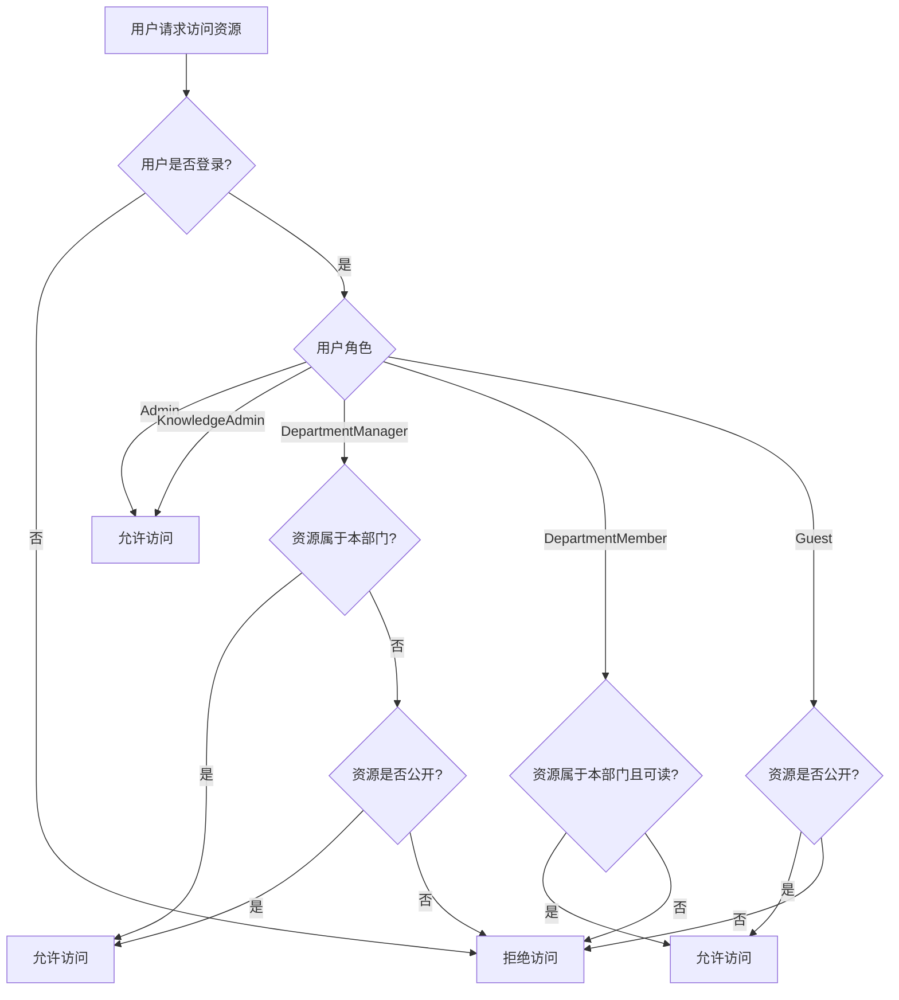
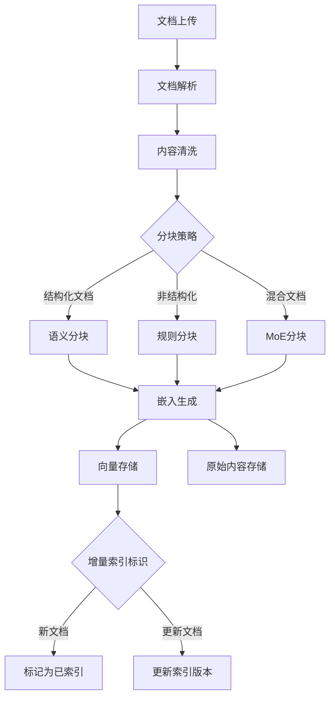
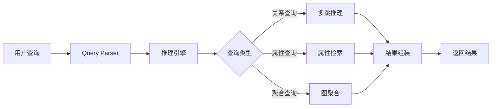
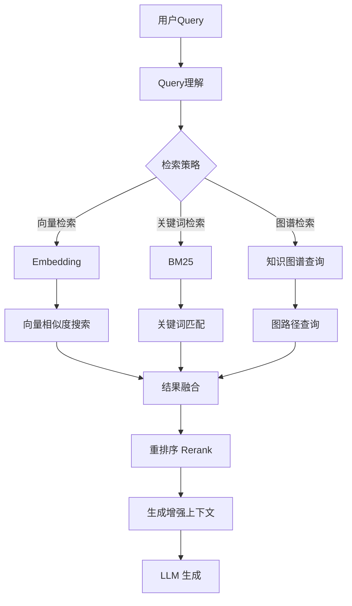
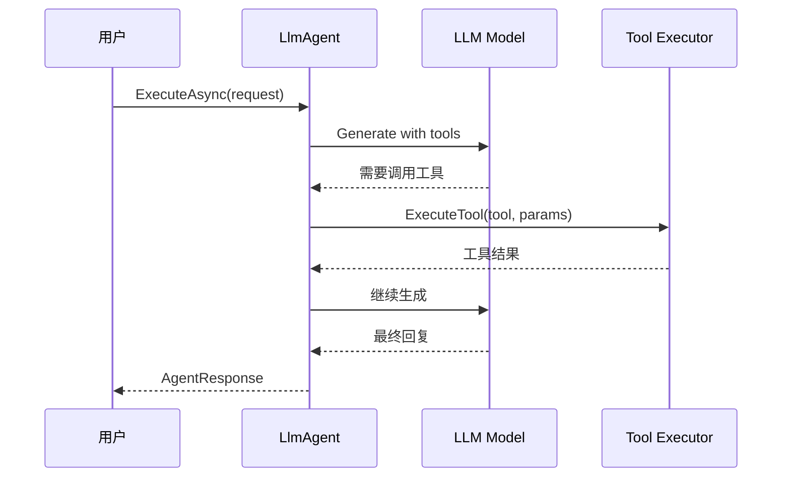
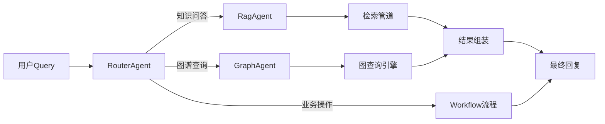
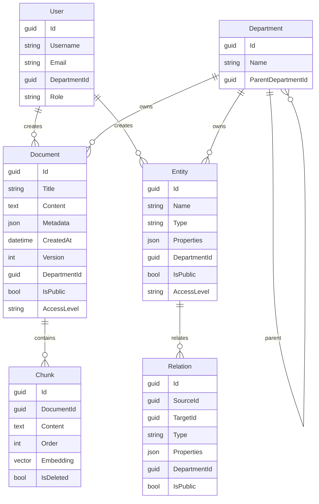
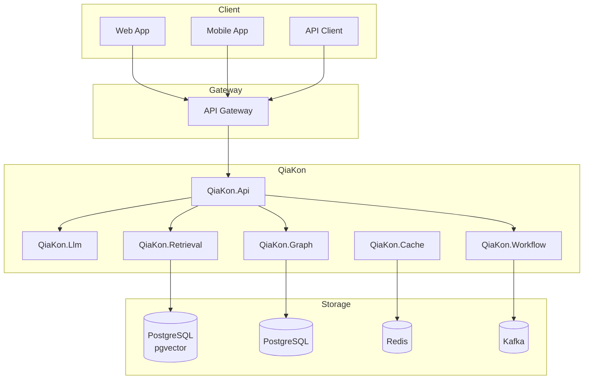

# QiaKon KAG 平台产品需求文档

## 一、项目概述

### 1.1 项目简介

**QiaKon** 是一个企业级 KAG（Knowledge Answer Graph，知识问答图谱）平台，旨在将知识图谱的结构化推理能力与 RAG（检索增强生成）的灵活检索能力深度融合，为企业提供准确、可信、可溯源的智能问答能力。

### 1.2 核心价值

| 价值点         | 描述                                               |
| -------------- | -------------------------------------------------- |
| **知识可信**   | 基于知识图谱的结构化知识组织，答案可溯源、可审计   |
| **推理可解释** | 显式推理链路，决策过程透明可查                     |
| **检索精准**   | 混合检索（向量+关键词+图谱关系），提升召回与精度   |
| **领域适配**   | 支持 MoE（混合专家）分块策略，适配不同领域知识特点 |
| **工程可扩展** | 模块化架构，连接器模式，灵活对接企业内部系统       |

### 1.3 目标用户

| 角色              | 描述                                   |
| ----------------- | -------------------------------------- |
| **企业开发者**    | 集成 KAG 能力到内部应用的技术团队      |
| **AI 应用工程师** | 构建智能问答、辅助决策类应用的研发人员 |
| **知识管理员**    | 管理知识库、配置检索策略的业务人员     |
| **终端用户**      | 使用智能问答服务的最终用户             |

### 1.4 权限控制

#### 1.4.1 设计目标

确保知识文档和图谱实体按照组织架构和用户角色进行访问控制，防止未授权访问。

#### 1.4.2 权限模型

采用 **RBAC（基于角色的访问控制）** + **ABAC（基于属性的访问控制）** 混合模型：

| 模型     | 适用场景     | 说明                                 |
| -------- | ------------ | ------------------------------------ |
| **RBAC** | 角色权限管理 | 用户属于某个角色，角色关联权限集合   |
| **ABAC** | 细粒度控制   | 基于用户属性（如部门、职级）动态判断 |

#### 1.4.3 权限层级

| 层级       | 说明                                               |
| ---------- | -------------------------------------------------- |
| **文档级** | 指定文档谁能看、谁能改、谁能删                     |
| **图谱级** | 指定实体/关系谁能看、谁能改、谁能删                |
| **字段级** | 指定字段是否对某角色可见（如薪资字段仅管理层可见） |

#### 1.4.4 内置角色

| 角色                  | 权限范围                                         |
| --------------------- | ------------------------------------------------ |
| **Admin**             | 全局管理，可访问所有文档/图谱，可管理用户和角色  |
| **KnowledgeAdmin**    | 管理所有知识文档和图谱，可配置分块策略和检索策略 |
| **DepartmentManager** | 管理本部门知识，可查看/编辑本部门文档            |
| **DepartmentMember**  | 查看本部门文档，不可编辑/删除                    |
| **Guest**             | 仅可查看公开文档                                 |

#### 1.4.5 权限判断流程



#### 1.4.6 检索时的权限过滤

RAG 检索管道在执行检索前，必须注入当前用户的权限上下文：

1. 获取用户角色和所属部门
2. 构建权限过滤条件（如 `department_id IN (user.departments) OR is_public = true`）
3. 检索时自动追加权限过滤，确保返回结果仅包含用户有权限访问的文档/图谱

### 1.5 日志与审计要求

| 类别         | 级别           | 说明                                                       |
| ------------ | -------------- | ---------------------------------------------------------- |
| **应用日志** | Warning 及以上 | 正常流程不打印，异常/警告/错误记录                         |
| **审计日志** | Info           | 记录到人的操作审计，记录操作用户、时间、操作类型、操作对象 |

---

## 二、架构设计

### 2.1 系统架构图

```
┌─────────────────────────────────────────────────────────────────┐
│                         QiaKon KAG Platform                      │
├─────────────────────────────────────────────────────────────────┤
│  ┌──────────────┐  ┌──────────────┐  ┌──────────────┐           │
│  │   QiaKon.Api │  │  QiaKon.Llm  │  │ QiaKon.Workflow│         │
│  │  (ASP.NET)   │  │   (Agent)    │  │   (Pipeline)  │           │
│  └──────┬───────┘  └──────┬───────┘  └──────┬───────┘           │
│         │                 │                 │                    │
│  ┌──────▼─────────────────▼─────────────────▼───────┐             │
│  │                  QiaKon.Retrieval                │             │
│  │  ┌─────────┐ ┌─────────┐ ┌─────────┐ ┌───────┐ │             │
│  │  │Document │ │ Chunking│ │Embedding│ │Vector │ │             │
│  │  │Processor│ │  (MoE)  │ │         │ │Store  │ │             │
│  │  └─────────┘ └─────────┘ └─────────┘ └───────┘ │             │
│  └──────────────────────┬──────────────────────────┘             │
│                         │                                        │
│  ┌──────────────────────▼──────────────────────────┐             │
│  │              QiaKon.Graph.Engine                │             │
│  │    ┌─────────────┐    ┌─────────────────┐      │             │
│  │    │   Memory    │    │    Npgsql       │      │             │
│  │    │  (Hot Data) │    │ (Cold Storage)  │      │             │
│  │    └─────────────┘    └─────────────────┘      │             │
│  └──────────────────────┬──────────────────────────┘             │
│                         │                                        │
│  ┌──────────────────────▼──────────────────────────┐             │
│  │              QiaKon.Connector                    │             │
│  │   ┌──────────┐ ┌──────────┐ ┌──────────────┐   │             │
│  │   │  Http    │ │  Npgsql  │ │   Kafka      │   │             │
│  │   │Connector │ │Connector │ │  (Future)   │   │             │
│  │   └──────────┘ └──────────┘ └──────────────┘   │             │
│  └──────────────────────┬──────────────────────────┘             │
│                         │                                        │
│  ┌──────────────────────▼──────────────────────────┐             │
│  │               QiaKon.Cache                      │             │
│  │   ┌──────────┐ ┌──────────┐ ┌──────────────┐   │             │
│  │   │  Memory  │ │  Hybrid  │ │    Redis     │   │             │
│  │   │  (L1)    │ │  (L2)    │ │   (L3)       │   │             │
│  │   └──────────┘ └──────────┘ └──────────────┘   │             │
│  └─────────────────────────────────────────────────┘             │
└─────────────────────────────────────────────────────────────────┘
```

### 2.2 核心模块职责

| 模块                    | 职责                                  | 存储后端              |
| ----------------------- | ------------------------------------- | --------------------- |
| **QiaKon.Api**          | HTTP API 暴露，接收用户请求           | -                     |
| **QiaKon.Llm**          | LLM 调用封装、Agent 编排、Prompt 管理 | -                     |
| **QiaKon.Workflow**     | 流程编排，Step/Stage/Pipeline 模式    | -                     |
| **QiaKon.Retrieval**    | 文档处理、分块、嵌入、检索            | PostgreSQL (pgvector) |
| **QiaKon.Graph.Engine** | 知识图谱存储与查询                    | Memory / Npgsql       |
| **QiaKon.Connector**    | 外部系统连接（HTTP/Npgsql）           | -                     |
| **QiaKon.Cache**        | 多级缓存（Memory/Hybrid/Redis）       | -                     |
| **QiaKon.Queue**        | 消息队列                              | Kafka / Memory        |

---

## 三、功能模块设计

### 3.1 知识文档管理

#### 3.1.1 模块目标

支持多格式文档的接入、处理、存储与检索，为知识问答提供高质量的文档输入。

#### 3.1.2 功能点

| 功能点       | 描述                                           |
| ------------ | ---------------------------------------------- |
| 文档上传     | 支持 PDF、Word、Markdown、TXT 等格式           |
| 文档解析     | 提取文本、标题、表格、图表描述                 |
| 文档分块     | 基于 MoE 策略的智能分块                        |
| 嵌入生成     | 调用 LLM 生成向量表示                          |
| 向量存储     | 存储到 PostgreSQL (pgvector)，支持相似度检索   |
| **增量索引** | 支持对新增或变更文档进行增量索引，无需全量重建 |

#### 3.1.3 业务流程



#### 3.1.4 增量索引机制

| 场景     | 处理方式                         |
| -------- | -------------------------------- |
| 新增文档 | 立即索引，标记版本号             |
| 更新文档 | 检测变更，仅重新索引变更块       |
| 删除文档 | 标记删除状态，物理删除可异步执行 |
| 全量重建 | 提供独立接口，按需触发           |

#### 3.1.5 MoE 分块策略

| 策略                  | 适用场景       | 分块方式                   |
| --------------------- | -------------- | -------------------------- |
| **SemanticChunking**  | 语义连贯的文章 | 按语义边界切分             |
| **RecursiveChunking** | 层次结构文档   | 按层级递归切分             |
| **FixedSizeChunking** | 简单文本       | 按固定长度切分             |
| **TableChunking**     | 表格密集文档   | 表格独立分块               |
| **MoE**               | 混合复杂文档   | 专家路由，自动选择最优策略 |

---

### 3.2 知识图谱引擎

#### 3.2.1 模块目标

提供知识图谱的构建、存储、查询能力，支持结构化知识的推理与检索。

#### 3.2.2 核心概念

| 概念                | 说明                                       |
| ------------------- | ------------------------------------------ |
| **实体 (Entity)**   | 知识图谱中的节点，如"公司"、"产品"、"人物" |
| **关系 (Relation)** | 实体之间的连接，如"生产"、"属于"、"合作"   |
| **属性 (Property)** | 实体或关系的额外描述信息                   |
| **三元组 (Triple)** | 主语-谓语-宾语 结构                        |

#### 3.2.3 图存储后端

| 后端       | 适用场景             | 特点                       |
| ---------- | -------------------- | -------------------------- |
| **Memory** | 开发测试、小规模数据 | 高速访问，进程重启丢失     |
| **Npgsql** | 生产环境             | 持久化存储，支持大规模数据 |

#### 3.2.4 图查询能力



---

### 3.3 RAG 检索管道

#### 3.3.1 模块目标

实现检索增强生成全流程：文档索引、向量检索、混合检索、结果重排序。

#### 3.3.2 检索流程



#### 3.3.3 检索选项

| 选项             | 说明             |
| ---------------- | ---------------- |
| `topK`           | 返回 Top-K 结果  |
| `scoreThreshold` | 相似度阈值       |
| `filters`        | 元数据过滤条件   |
| `hybridSearch`   | 是否启用混合检索 |
| `enableRerank`   | 是否启用重排序   |

---

### 3.4 LLM Agent 引擎

#### 3.4.1 模块目标

提供基于 LLM 的智能代理能力，支持多轮对话、工具调用、复杂任务分解与执行。

#### 3.4.2 上下文工程（Context Engineering）

上下文工程负责管理 Agent 的输入上下文，确保 LLM 获取高质量的上下文信息。

| 组件                    | 职责           | 说明                                                              |
| ----------------------- | -------------- | ----------------------------------------------------------------- |
| **ConversationContext** | 对话上下文管理 | 消息列表管理、添加/删除消息、Token 估算                           |
| **ContextTemplate**     | 上下文模板     | 可复用的上下文模式，包含系统提示词、初始消息、最大消息数/Token 数 |
| **MessageTrimmer**      | 消息裁剪策略   | 上下文超限时决定保留哪些消息（默认保留最近消息）                  |
| **ContextVariable**     | 上下文变量     | 支持模板变量替换，如 `{{user_name}}`, `{{department}}`            |

**上下文裁剪策略**：

| 策略                | 说明                                               |
| ------------------- | -------------------------------------------------- |
| **DefaultTrimmer**  | 保留最近 N 条消息，删除旧消息                      |
| **PriorityTrimmer** | 保留高优先级消息（如系统消息、用户明确指定的消息） |
| **SummaryTrimmer**  | 将旧消息压缩为摘要，保留关键信息                   |

**上下文模板示例**：

```yaml
# 问答助手模板
name: "qa-assistant"
systemPromptTemplate: "你是一个专业的问答助手，专注于回答 {{domain}} 相关问题。"
maxMessages: 20
maxTokens: 8000

# 知识图谱查询模板
name: "graph-query"
systemPromptTemplate: "你是一个知识图谱助手，用户询问关于实体 {{entity}} 的信息。"
maxMessages: 10
```

#### 3.4.3 Agent 编排能力

支持将多个 Agent 或工具组合成复杂的工作流：

| 组件                 | 职责                                                          |
| -------------------- | ------------------------------------------------------------- |
| **LlmAgent**         | Agent 核心，执行循环（用户输入 → LLM → 工具调用/回复 → 用户） |
| **LlmTool**          | 工具定义（Name/Description/Parameters/Handler）               |
| **LlmRetryStrategy** | 调用失败重试策略（指数退避、固定间隔）                        |
| **AgentChain**       | Agent 链，多个 Agent 串联执行                                 |
| **AgentPool**        | Agent 池，支持并发执行                                        |

**Agent 编排模式**：

| 模式                | 说明                                         | 适用场景                 |
| ------------------- | -------------------------------------------- | ------------------------ |
| **SingleAgent**     | 单 Agent 独立执行                            | 简单问答、单一任务       |
| **SequentialChain** | 串联执行，上一 Agent 输出作为下一 Agent 输入 | 任务分解、多步推理       |
| **ParallelPool**    | 并行执行，多个 Agent 同时处理子任务          | 多文档对比分析、多源检索 |
| **RouterAgent**     | 路由 Agent，根据意图分发到不同处理 Agent     | 复杂对话、意图分流       |

#### 3.4.4 工具调用流程



#### 3.4.5 Agent 与工作流集成

Agent 可嵌入到 QiaKon.Workflow 流程中，与其他 Step/Stage 组合：



**内置 Agent 类型**：

| Agent             | 说明                       |
| ----------------- | -------------------------- |
| **RagAgent**      | 专注文档检索与问答         |
| **GraphAgent**    | 专注知识图谱查询与推理     |
| **ApiAgent**      | 调用外部 API 获取信息      |
| **WorkflowAgent** | 调用工作流执行复杂业务逻辑 |

---

### 3.5 工作流引擎

#### 3.5.1 模块目标

提供流程编排能力，支持复杂业务逻辑的 Step/Stage/Pipeline 组合。

#### 3.5.2 核心概念

| 概念                | 说明                            |
| ------------------- | ------------------------------- |
| **Step**            | 最小执行单元，对应具体操作      |
| **Stage**           | 阶段，包含多个并行或串行的 Step |
| **Pipeline**        | 完整流程，包含多个 Stage        |
| **WorkflowContext** | 工作流执行上下文，传递数据      |
| **RetryStep**       | 支持重试的 Step 封装            |

#### 3.5.3 流程模式

| 模式           | 说明                         |
| -------------- | ---------------------------- |
| **Sequential** | 串行执行，按顺序执行各 Stage |
| **Parallel**   | 并行执行，同一 Stage 内并行  |
| **Branching**  | 分支执行，根据条件选择路径   |
| **Retry**      | 失败重试，支持指数退避       |

---

### 3.6 多级缓存体系

#### 3.6.1 模块目标

提供多级缓存能力，加速热数据访问，降低后端存储压力。

#### 3.6.2 缓存层级

| 层级   | 实现        | 特点                          |
| ------ | ----------- | ----------------------------- |
| **L1** | MemoryCache | 进程内，最高速，低容量        |
| **L2** | HybridCache | 进程内+分布式，平衡速度与容量 |
| **L3** | RedisCache  | 分布式，最大容量，最低速度    |

#### 3.6.3 缓存策略

| 策略              | 说明                       |
| ----------------- | -------------------------- |
| **Cache-Aside**   | 应用自行管理缓存更新       |
| **Read-Through**  | 缓存未命中时自动从存储加载 |
| **Write-Through** | 写入时同步更新缓存         |
| **Write-Behind**  | 异步写入，提升写入性能     |

---

### 3.7 连接器框架

#### 3.7.1 模块目标

提供统一的外部系统连接抽象，支持配置驱动的连接器管理。

#### 3.7.2 连接器类型

| 连接器              | 说明                          |
| ------------------- | ----------------------------- |
| **HttpConnector**   | HTTP API 调用，支持端点配置化 |
| **NpgsqlConnector** | PostgreSQL 数据库连接         |
| **KafkaConnector**  | Kafka 消息队列（规划中）      |

#### 3.7.3 连接器生命周期

| 状态             | 说明         |
| ---------------- | ------------ |
| **Disconnected** | 未连接       |
| **Connecting**   | 连接中       |
| **Connected**    | 已连接       |
| **Healthy**      | 健康检查通过 |
| **Unhealthy**    | 健康检查失败 |
| **Closed**       | 已关闭       |

---

## 四、数据模型

### 4.1 核心实体

| 实体             | 说明     | 主要字段                                                                              |
| ---------------- | -------- | ------------------------------------------------------------------------------------- |
| **Document**     | 文档     | Id, Title, Content, Metadata, CreatedAt, Version, DepartmentId, IsPublic, AccessLevel |
| **Chunk**        | 文档块   | Id, DocumentId, Content, Order, Embedding, IsDeleted                                  |
| **Entity**       | 图谱实体 | Id, Name, Type, Properties, DepartmentId, IsPublic, AccessLevel                       |
| **Relation**     | 图谱关系 | Id, SourceId, TargetId, Type, Properties, DepartmentId, IsPublic                      |
| **Conversation** | 对话会话 | Id, Messages, CreatedAt, Status                                                       |
| **User**         | 用户     | Id, Username, Email, DepartmentId, Role                                               |
| **Department**   | 部门     | Id, Name, ParentDepartmentId                                                          |

### 4.2 权限字段说明

| 字段           | 说明                                 | 可选值                                               |
| -------------- | ------------------------------------ | ---------------------------------------------------- |
| `DepartmentId` | 所属部门ID，null 表示公共资源        | UUID 或 null                                         |
| `IsPublic`     | 是否公开（公开资源所有登录用户可见） | true/false                                           |
| `AccessLevel`  | 访问级别                             | `Public`, `Department`, `Restricted`, `Confidential` |

| AccessLevel      | 说明                                   |
| ---------------- | -------------------------------------- |
| **Public**       | 所有登录用户可读                       |
| **Department**   | 仅本部门成员可读写                     |
| **Restricted**   | 仅指定角色可读写                       |
| **Confidential** | 仅 Admin 和资源所属部门 Manager 可读写 |

### 4.3 实体关系图



---

## 五、API 设计

### 5.1 文档管理 API

| 接口                     | 方法   | 说明                     |
| ------------------------ | ------ | ------------------------ |
| `/api/documents`         | POST   | 上传文档                 |
| `/api/documents`         | GET    | 获取文档列表             |
| `/api/documents/{id}`    | GET    | 获取文档详情             |
| `/api/documents/{id}`    | PUT    | 更新文档（触发增量索引） |
| `/api/documents/{id}`    | DELETE | 删除文档                 |
| `/api/documents/reindex` | POST   | 全量重建索引             |

### 5.2 检索 API

| 接口            | 方法 | 说明         |
| --------------- | ---- | ------------ |
| `/api/retrieve` | POST | 检索相关文档 |
| `/api/rag/chat` | POST | RAG 对话     |

### 5.3 知识图谱 API

| 接口                   | 方法 | 说明     |
| ---------------------- | ---- | -------- |
| `/api/graph/entities`  | POST | 创建实体 |
| `/api/graph/entities`  | GET  | 查询实体 |
| `/api/graph/relations` | POST | 创建关系 |
| `/api/graph/query`     | POST | 图查询   |

### 5.4 Agent API

| 接口                 | 方法 | 说明       |
| -------------------- | ---- | ---------- |
| `/api/agent/chat`    | POST | Agent 对话 |
| `/api/agent/execute` | POST | 执行工具   |

---

## 六、部署架构

### 6.1 推荐架构



### 6.2 依赖说明

| 组件       | 版本要求 | 说明                           |
| ---------- | -------- | ------------------------------ |
| .NET       | 8.0+     | 运行时                         |
| PostgreSQL | 15+      | 主数据库、向量存储（pgvector） |
| Redis      | 7.0+     | 分布式缓存                     |
| Kafka      | 3.0+     | 消息队列（可选）               |

---

## 七、验收标准

### 7.1 功能验收

| 模块         | 验收点                                                                          |
| ------------ | ------------------------------------------------------------------------------- |
| 文档管理     | 支持主流文档格式上传、解析、增量索引                                            |
| **权限控制** | **文档/图谱按部门、角色、AccessLevel 进行访问控制，检索结果自动过滤无权限资源** |
| 检索管道     | 向量检索延迟 < 100ms（10000 条数据）                                            |
| 知识图谱     | 支持三元组增删改查、多跳推理                                                    |
| Agent        | 支持多轮对话、工具调用                                                          |
| 工作流       | 支持 Step/Stage/Pipeline 组合执行                                               |
| 缓存         | 多级缓存命中率 > 80%（热数据）                                                  |

### 7.2 非功能验收

| 指标         | 目标                    |
| ------------ | ----------------------- |
| API 响应时间 | P99 < 200ms             |
| 系统可用性   | 99.9%                   |
| 数据一致性   | 最终一致，副本同步 < 1s |

### 7.3 日志与审计

| 类别     | 级别           | 记录内容                                   |
| -------- | -------------- | ------------------------------------------ |
| 应用日志 | Warning 及以上 | 异常、警告、错误信息                       |
| 审计日志 | Info           | 操作人、操作用户、时间、操作类型、操作对象 |

---

## 八、后续扩展项

以下功能暂不纳入本期范围，后续迭代增加：

| 功能         | 优先级 | 说明                     |
| ------------ | ------ | ------------------------ |
| 用户反馈机制 | P2     | 用户对答案进行评价反馈   |
| 模型微调     | P3     | 基于反馈数据微调领域模型 |
| 多租户支持   | P1     | 租户隔离与配额管理       |

---

*文档版本：v0.4*
*创建日期：2026-04-28*
*更新日期：2026-04-28*
*变更记录：*
- *v0.3 新增权限控制设计（RBAC+ABAC混合模型，文档/图谱级权限，检索时自动过滤）*
- *v0.4 新增上下文工程（ContextTemplate、MessageTrimmer、上下文裁剪策略）和 Agent 编排能力（AgentChain、RouterAgent、内置 Agent 类型）*